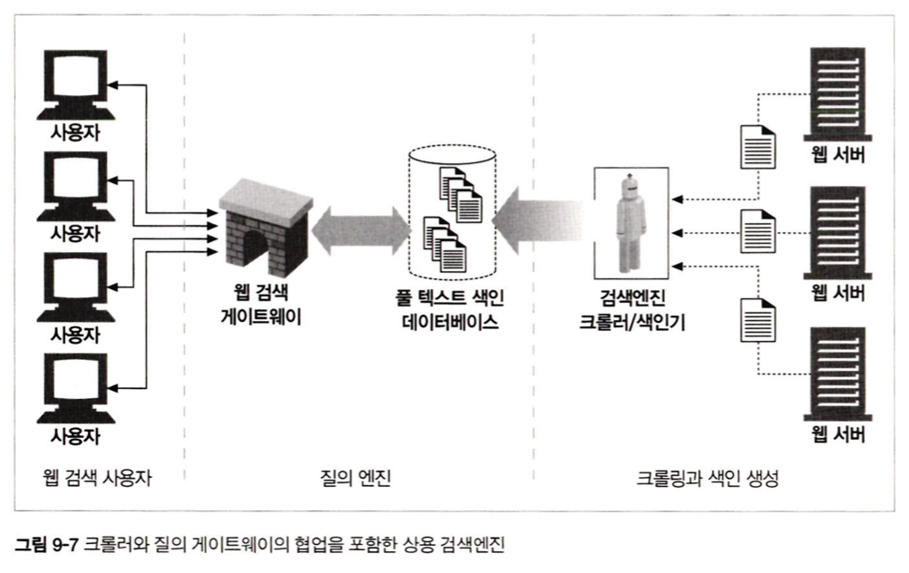
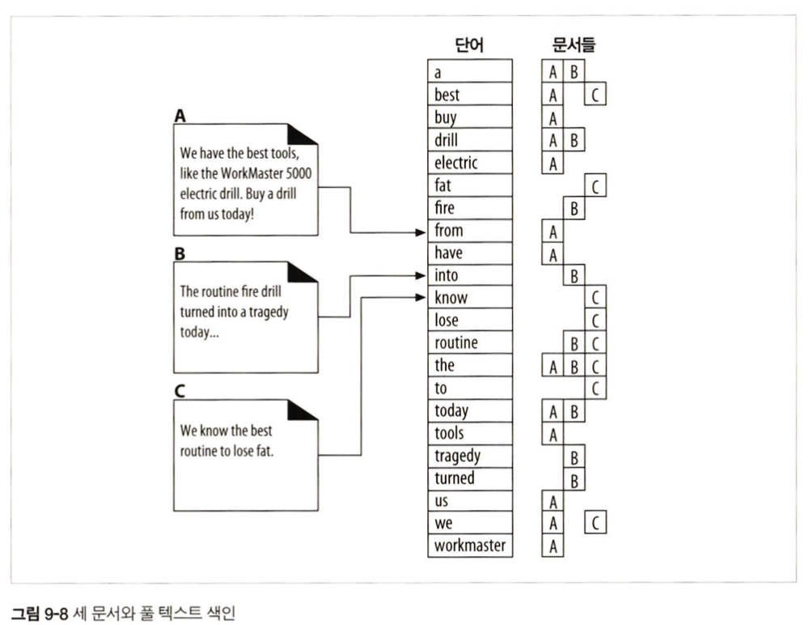

<br>
<br>
<br>


### 9.4.2 웹 사이트와 robots.txt 파일들
웹 관리자는 웹 사이트의 모든 콘텐츠에 대한 차단 규칙을 종합적으로 기술한 robots.txt 파일을 생성할 책임이 있다.   
-> 없다면 로봇은 제약없이 사이트에 접근한다.  
-> 401 혹은 403 권한 없음으로 응답하면 로봇은 해당 사이트로의 접근을 아예 해서는 안된다.  
-> 503 일시적 실패라면 일정 시간 후 다시 시도한다  
-> 3XX 리다이렉션 응답이라면 로봇은 리소스가 발견될 때까지 리다이렉트를 따라간다  

<br>

**HTTP 크롤러의 요청 예시**
```yml
GET /robots.txt HTTP/1.0
Host: www.joes-hardware.com
User-Agent: Slurp/2.0
Date: Wed Oct 3 20:22:48 EST 2001
```

**robots.txt 예시**
```yml
# slurp, webcrawler가 우리 사이트의 공개된 영역을 크롤링하는 것을 허용
User-Agent: slurp
User-Agent: webcrawler
Disallow: /private

User-Agent: *
Disallow:
```
-> 이때 로봇은 자신이 이해할 수 없는 필드는 무시해야함 (보수적으로 동작)  

<br>
<br>
<br>


### 9.4.3 HTML 로봇 제어 META 태그
html의 meta 태그를 통해서 로봇이 개별 페이지에 접근하는 것을 좀 더 직접적으로 제한할 수 있다.  

ex)
```html
<META NAME="ROBOTS" CONTENT="NOINDEX"> // 이 페이지를 처리하지 말고 무시
<META NAME="ROBOTS" CONTENT="NOFOLLOW"> // 이 페이지가 링크한 페이지를 무시
<META NAME="ROBOTS" CONTENT="INDEX"> // 이 페이지의 콘텐츠를 인덱싱해도 됨
<META NAME="ROBOTS" CONTENT="FOLLOW"> // 이 페이지가 링크한 페이지를 크롤링해도 됨
<META NAME="ROBOTS" CONTENT="NOARCHIVE"> // 이 페이지의 캐시를 만들어서는 안됨
<META NAME="ROBOTS" CONTENT="ALL"> // ALL=INDEX + FOLLOW   
<META NAME="ROBOTS" CONTENT="NONE"> // NOINDEX + NOFOLLOW
```


<br>
<br>
<br>

### 9.6 검색 엔진
웹 로봇을 가장 광범위하게 사용하는 것이 `인터넷 검색엔진`  
-> 웹 크롤러들이 검색엔진에게 웹에 존재하는 문서들을 가져다줌  
-> 검색엔진은 이를 이용해서 어떤 문서에 어떤 단어들이 존재하는지 index를 생성  

<br>
<br>

### 9.6.2 현대적인 검색엔진 아키텍처
오늘날 검색엔진들은 전 세계 웹 페이지들에 대해 `풀 텍스트 색인(full-text indexes)`이라고 불리는 복잡한 로컬 데이터베이스를 생성  
-> 그러나 웹페이지는 매 순간 변화하기 때문에 풀 텍스트 색인은 `웹의 특정 순간에 대한 스냅샷`에 불과함

<div align="center">
    
</div>
-> 게이트웨이 프로그램은 사용 검색 질의를 추출하고 풀 텍스트 인덱스 검색을 할 때 사용되는 표현식으로 변환함  

<br>
<br>

### 9.6.2 현대적인 검색엔진 아키텍처
풀 텍스트 인덱스는 단어 하나를 입력받아 그 단어를 포함하고 있는 문서를 즉각 알려줄 수 있는 데이터베이스  
<div align="center">
    
</div>


<br>
<br>

### 9.6.5 검색 결과를 정렬하고 보여주기
검색을 했을 때 보통 정확도 등의 순서로 보여주는데,  
이를 위해 많은 검색 엔진은 웹 크롤링에서 얻은 정보(ex. 해당 페이지를 가리키는 링크들의 수)를 활용함  
-> 대부분 웹 사이트 운영자들은 이런 알고리즘을 이용해 자신의 페이지를 상위 랭크 시키려 노력함  